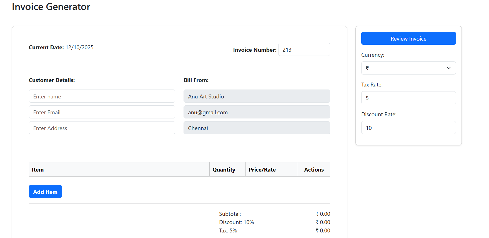
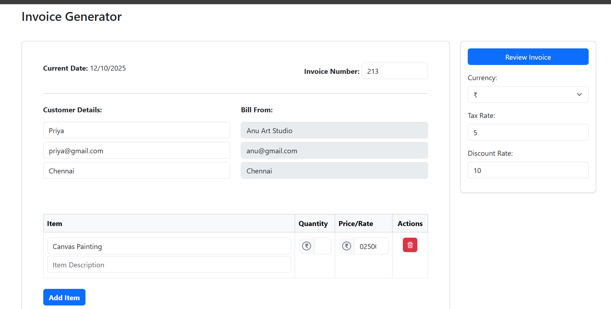

# 🧾 Invoice Generator


A simple and responsive **Invoice Generator** built using **React.js**, **Bootstrap**, and **Vite**.  
It helps users create invoices quickly, calculate totals automatically, and review them in real time.

---

## 🧩 Problem Statement

Manually preparing invoices is repetitive and error-prone.  
Users need an easy-to-use tool to:
- Input customer and company details.
- Add or remove multiple items.
- Auto-calculate totals including tax and discount.

---

## 💡 Solution

The **Invoice Generator App** provides:
- Dynamic item addition and deletion.
- Real-time calculations for subtotal, discount, tax, and grand total.
- Responsive layout for both desktop and tablet.
- Customizable tax rate, discount rate, and currency.

---

## ⚙️ Features

✅ Add, edit, and delete items dynamically  
✅ Automatic calculation of subtotal, discount, tax, and total  
✅ Currency selection support  
✅ Clean and responsive design  
✅ Built with reusable React components  

---

## 🧠 Tech Stack

- ⚛️ **React.js** — Frontend library  
- 🎨 **Bootstrap 5** — Styling and layout  
- ⚡ **Vite** — Development and build tool  
- 💻 **JavaScript (ES6)**  
- 🧾 **HTML5 / CSS3**

---
## App Interface

 ## Invoice Output
 

##Example Review Page


The **Invoice-Generator** game is hosted on **Vercel**, making it available as a public website. 

[Invoice-Generator](https://invoice-generator-wheat-one.vercel.app/)
## 🚀 Getting Started

Follow these steps to run the project locally:

### 1️⃣ Clone the Repository
```bash
git clone https://github.com/<your-username>/Invoice-Generator.git
cd Invoice-Generator
npm install
npm run dev
```
Thank you for checking out this project!
If you found it helpful, please consider giving it a ⭐ on GitHub — it helps support and grow the project 💙

“Design. Build. Iterate. Learn.”
— Lithika M
